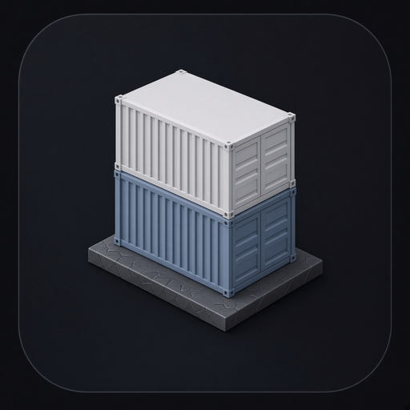

<p align="center">
  
</p>

<h1 align="center">Quay</h1>

<p align="center">A desktop for <a href="https://learn.microsoft.com/windows/wsl/wsl-container">WSL containers</a> (<code>wslc</code>).</p>


A **quay** is a dock — the stone edge where ships tie up. Linux containers on Windows are the ships. This app is the berth: list them, pull images, start and stop, exec in, watch logs, hand GPU and ports across, all from a Tauri WebView whose native work is C# on `Microsoft.WSL.Containers`.

Microsoft shipped `wslc.exe` (and the alias `container.exe`) in WSL 2.9.3. Same muscle memory as Docker (`run`, `pull`, `ps`, `stop`), but the runtime is a dedicated Hyper-V VM — virtiofs, consomme networking, CDI GPU — not Docker Desktop. Windows apps can drive that VM through a NuGet package. Quay is that API with a UI.

```
┌─────────────────────┐     JSON over stdin      ┌──────────────────────────┐
│  Tauri WebView      │ ───────────────────────► │  Quay.Host (C#)          │
│  this UI            │                          │  Microsoft.WSL.Containers│
│                     │ ◄─────────────────────── │                          │
└─────────────────────┘     stdout events        └────────────┬─────────────┘
                                                              │ WinRT
                                                 ┌────────────▼─────────────┐
                                                 │  WSL container VM        │
                                                 │  Hyper-V · virtiofs      │
                                                 │  consomme · CDI GPU      │
                                                 └──────────────────────────┘
```

Rust stays a thin bridge (`src-tauri`). Every button in the UI is an `invoke` that becomes `Session.PullImageAsync`, `CreateContainer`, `Start`, `Stop`, or `CreateProcess`.

## Install

Windows x64. WSL **2.9.3+** (`wsl --update --pre-release`) and `wslc.exe` on PATH.

**[Download the latest installer](https://github.com/dhhieu113pro/quay/releases/latest)**

| File | Install |
| --- | --- |
| `Quay_*_x64-setup.exe` | Double-click. Silent: `Quay_*_x64-setup.exe /S` |
| `Quay_*_x64_en-US.msi` | Double-click. Silent: `msiexec /i Quay_*.msi /quiet` |

GitHub Actions cuts those on every `v*` tag. Microsoft Store uses the same NSIS build — Partner Center steps are in [`docs/store.md`](docs/store.md). Listing copy: [`store/listing.md`](store/listing.md).


## What you can do

- **Session** — `WslcService.GetMissingComponents()`, then `SessionSettings` (vCPU, memory, data path) and `Session.Start()` / `Terminate()`
- **Images** — pull with progress (`ImageProgress`), remove, list
- **Containers** — run with ports, env, bind mounts, `--gpus all`; start / stop / restart / delete; inspect; logs; exec
- **Volumes** — create and attach
- **C# host** — live invoke log of the exact `Microsoft.WSL.Containers` calls the sidecar would make

The in-browser lab simulates a running session (nginx, Postgres, Redis, Webtop, a CUDA trainer) so the desktop is usable without Windows. On a real box, `src/lib/wslc/store.ts` is replaced by JSON to `host/`.

## Requirements (Windows)

- WSL **2.9.3+**: `wsl --update --pre-release`
- `wslc.exe` on PATH (`wslc version`)
- .NET 9 Windows targeting pack
- NuGet: `Microsoft.WSL.Containers`

```powershell
wsl --update --pre-release
wslc version
dotnet add host package Microsoft.WSL.Containers
```

## C# sidecar

```bash
cd host
dotnet run
```

JSON lines on stdin, JSON lines on stdout:

```json
{"cmd":"pull","image":"docker.io/library/nginx:latest"}
{"cmd":"run","image":"nginx:latest","name":"web"}
{"cmd":"stop","id":"..."}
{"cmd":"rm","id":"..."}
{"cmd":"ps"}
```

CLI equivalents: `wslc pull`, `wslc run`, `wslc container stop`, `wslc container rm`, `wslc container ps`.

Minimal host:

```csharp
using Microsoft.WSL.Containers;

var missing = WslcService.GetMissingComponents();
var session = new Session(new SessionSettings("Quay", @"C:\WslcData")
{
    CpuCount = 4,
    MemorySizeInMB = 4096
});
session.Start();

var pull = session.PullImageAsync(new PullImageOptions("docker.io/library/nginx:latest"));
await pull;

var container = session.CreateContainer(new ContainerSettings("nginx:latest")
{
    Name = "web",
    InitProcess = new ProcessSettings { OutputMode = ProcessOutputMode.Event }
});
container.Start();
```

## UI

```bash
npm install
npm run dev
```

On Windows, with Node 22, Rust, and .NET 9:

```powershell
./scripts/prepare-sidecar.ps1
npm run tauri -- build --bundles nsis,msi
```


| Path | Role |
| --- | --- |
| `src/` | React desktop (overview, containers, images, session, C# host) |
| `host/` | `Quay.Host` — C# sidecar, `quay-host.exe` |
| `src-tauri/` | Tauri 2 bridge: `wslc_invoke` → sidecar stdin |
| `.github/workflows/release.yml` | Tag `v*` → GitHub Release (NSIS + MSI) |
| `.github/workflows/store.yml` | Store bundle + optional Partner Center submit |
| `docs/store.md` | Partner Center steps, silent flags, secrets |
| `docs/logo.png` | App mark — isometric containers and a gantry on a quay |

## License

MIT
