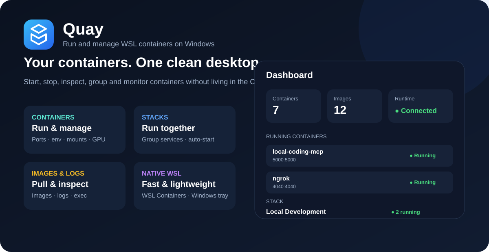
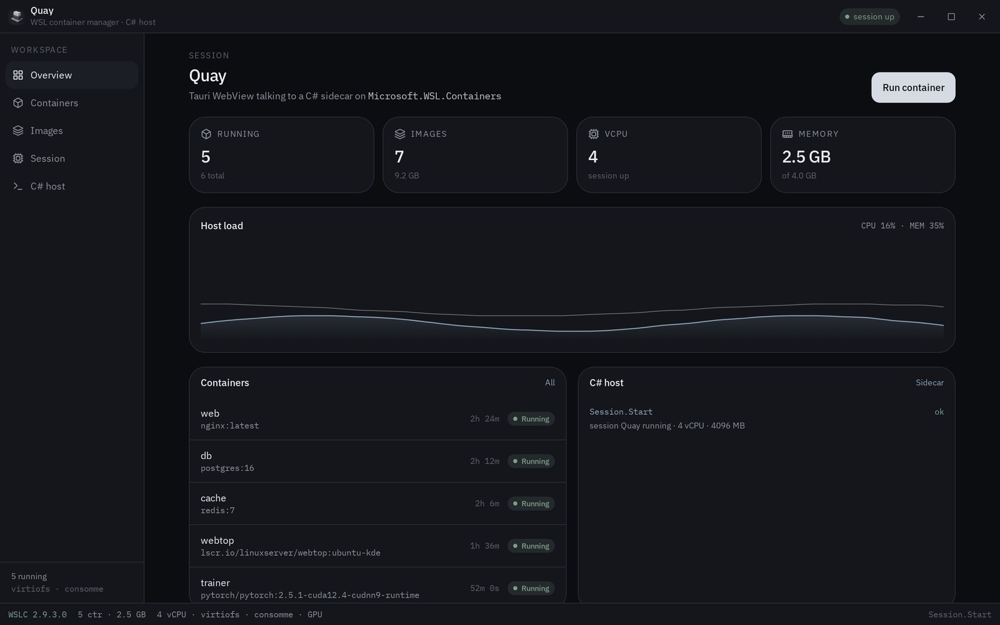
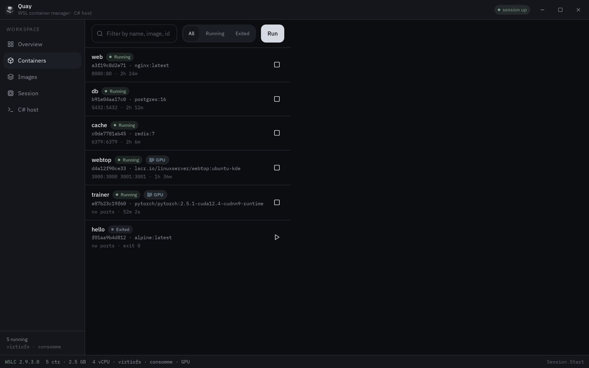
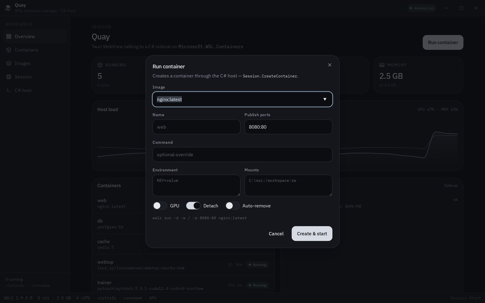
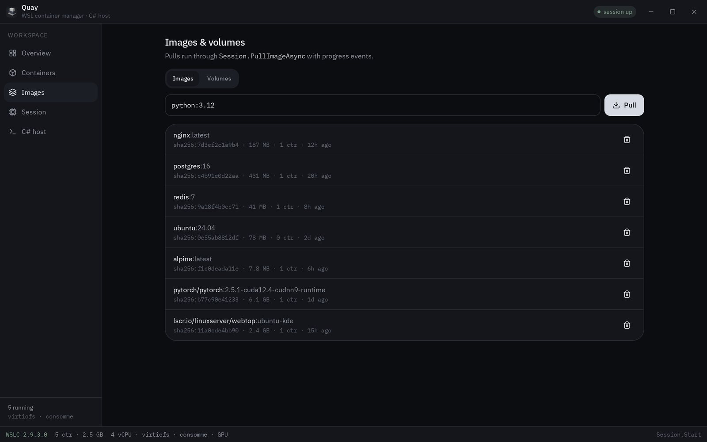
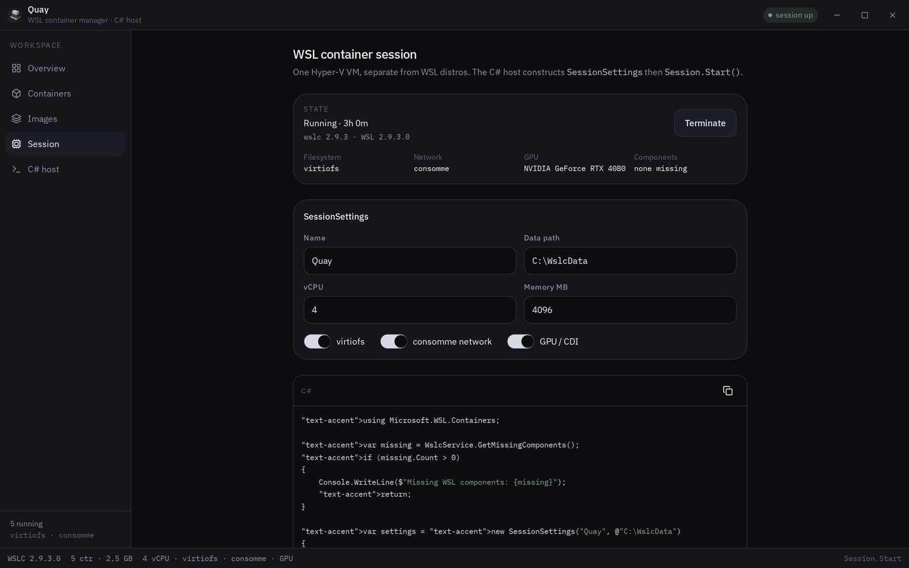

<p align="center">
  
</p>

<h1 align="center">Quay</h1>

<p align="center">A desktop for <a href="https://learn.microsoft.com/windows/wsl/wsl-container">WSL containers</a> (<code>wslc</code>).</p>

<p align="center">
  
</p>

A **quay** is a dock — the stone edge where ships tie up. Linux containers on Windows are the ships. This app is the berth: list them, pull images, start and stop, exec in, watch logs, hand GPU and ports across, all from a Tauri WebView whose native work is C# on `Microsoft.WSL.Containers`.

Microsoft shipped `wslc.exe` (and the alias `container.exe`) in WSL 2.9.3. Same muscle memory as Docker (`run`, `pull`, `ps`, `stop`), but the runtime is a dedicated Hyper-V VM — virtiofs, consomme networking, CDI GPU — not Docker Desktop. Windows apps can drive that VM through a NuGet package. Quay is that API with a UI.

<p align="center">
  
</p>
<p align="center">
  
  &nbsp;
  
</p>
<p align="center">
  
  &nbsp;
  
</p>

```
┌─────────────────────┐     JSON over stdin      ┌──────────────────────────┐
│  Tauri WebView      │ ───────────────────────► │  Quay.Host (C#)          │
│  this UI            │                          │  Microsoft.WSL.Containers│
│                     │ ◄─────────────────────── │                          │
└─────────────────────┘     stdout events        └────────────┬─────────────┘
                                                              │ WinRT
                                                 ┌────────────▼─────────────┐
                                                 │  WSL container VM        │
                                                 │  Hyper-V · virtiofs      │
                                                 │  consomme · CDI GPU      │
                                                 └──────────────────────────┘
```

Rust stays a thin bridge (`src-tauri`). Every button in the UI is an `invoke` that becomes a native sidecar operation using `Microsoft.WSL.Containers` or `wslc`.

## Install

Windows x64 and ARM64. WSL **2.9.3+** (`wsl --update --pre-release`) and `wslc.exe` on PATH.

**[Download the latest installer](https://github.com/dhhieu113pro/quay/releases/latest)**

| File | Machine |
| --- | --- |
| `Quay_*_x64-setup.exe` | Intel / AMD. Silent: `/S` |
| `Quay_*_arm64-setup.exe` | Snapdragon / Copilot+ / ARM64. Silent: `/S` |
| `Quay_*_*_en-US.msi` | Same arches. Silent: `msiexec /i Quay_*.msi /quiet` |

Close hides to the tray; quit from the tray menu. Appearance follows sunrise and sunset, or lock light / dark from the titlebar.

Every push to `main` runs **CI** (typecheck + both Windows installers as artifacts). Tag `v*` runs **Release** onto GitHub Releases. Microsoft Store is a separate manual workflow — Partner Center steps are in [`docs/store.md`](docs/store.md). Listing copy: [`store/listing.md`](store/listing.md).

## What you can do

- **Session** — `WslcService.GetMissingComponents()`, then `SessionSettings` (vCPU, memory, data path) and `Session.Start()` / `Terminate()`
- **Images** — pull with progress (`ImageProgress`), remove, list
- **Containers** — run with ports, env, bind mounts, `--gpus all`; start / stop / restart / delete; inspect; logs; exec
- **Groups** — start and stop related containers together, share a network, and keep group-specific environment/mount configuration
- **Volumes** — create and attach
- **Appearance** — auto light/dark by sunset, or lock either; close hides to the tray

The in-browser lab simulates a running session (nginx, Postgres, Redis, Webtop, a CUDA trainer) so the desktop is usable without Windows. On a real box, `src/lib/wslc/store.ts` talks through the Tauri bridge to `host/`.

## Requirements (Windows)

- WSL **2.9.3+**: `wsl --update --pre-release`
- `wslc.exe` on PATH (`wslc version`)
- .NET 9 Windows targeting pack (development/build only)
- NuGet: `Microsoft.WSL.Containers`

```powershell
wsl --update --pre-release
wslc version
dotnet add host package Microsoft.WSL.Containers
```

## C# sidecar

Quay ships `Quay.Host` as a self-contained sidecar. End users do not build it and do not need the .NET SDK. Development and CI compile the sidecar before Tauri packages the application.

```bash
cd host
dotnet run
```

JSON lines on stdin, JSON lines on stdout:

```json
{"cmd":"pull","image":"docker.io/library/nginx:latest"}
{"cmd":"run","image":"nginx:latest","name":"web"}
{"cmd":"stop","id":"..."}
{"cmd":"rm","id":"..."}
{"cmd":"ps"}
```

CLI equivalents: `wslc pull`, `wslc run`, `wslc container stop`, `wslc container rm`, `wslc container ps`.

Minimal host:

```csharp
using Microsoft.WSL.Containers;

var missing = WslcService.GetMissingComponents();
var session = new Session(new SessionSettings("Quay", @"C:\WslcData")
{
    CpuCount = 4,
    MemorySizeInMB = 4096
});
session.Start();

var pull = session.PullImageAsync(new PullImageOptions("docker.io/library/nginx:latest"));
await pull;

var container = session.CreateContainer(new ContainerSettings("nginx:latest")
{
    Name = "web",
    InitProcess = new ProcessSettings { OutputMode = ProcessOutputMode.Event }
});
container.Start();
```

## UI / development

```bash
npm install
npm run tauri dev
```

`npm run tauri dev` ensures the matching C# sidecar exists (`src-tauri/binaries/quay-host-*.exe`) before starting Vite/Tauri. The sidecar is rebuilt when the C# source/project is newer than the bundled executable.

To force a clean sidecar rebuild after pulling native-host changes:

```powershell
powershell -ExecutionPolicy Bypass -File scripts/ensure-sidecar.ps1 -Force
```

> **Important:** Quay's UI can compile successfully while an old `quay-host.exe` is still present. A stale sidecar may make new native features appear to do nothing (for example, a Group Start changes UI state but no WSLC container is created). If native behavior does not match the current source, force-rebuild the sidecar and restart Quay. `prepare-sidecar.ps1` now fails immediately when `dotnet publish` fails so a failed build cannot silently copy an older executable.

For release/Store builds, CI must build the sidecar **before** packaging Quay. The installed application contains the self-contained sidecar; it must never attempt to compile C# on the end user's machine.

```powershell
./scripts/prepare-sidecar.ps1          # or: npm run sidecar
npm run tauri -- build --bundles nsis,msi
```

| Path | Role |
| --- | --- |
| `src/` | React desktop (overview, containers, groups, images, session) |
| `host/` | `Quay.Host` — C# sidecar, `quay-host.exe` |
| `src-tauri/` | Tauri 2 bridge: `wslc_invoke` → sidecar stdin |
| `.github/workflows/ci.yml` | Every push / PR — typecheck + x64/ARM64 installers as artifacts |
| `.github/workflows/release.yml` | Tag `v*` → GitHub Release (NSIS + MSI) |
| `.github/workflows/store.yml` | Store bundle + optional Partner Center submit |
| `docs/store.md` | Partner Center steps, silent flags, secrets |
| `docs/logo.png` | App mark — isometric containers and a gantry on a quay |
| `docs/shots/` | Product screenshots used above |

## License

MIT
